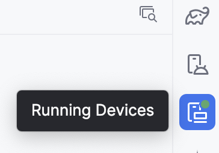
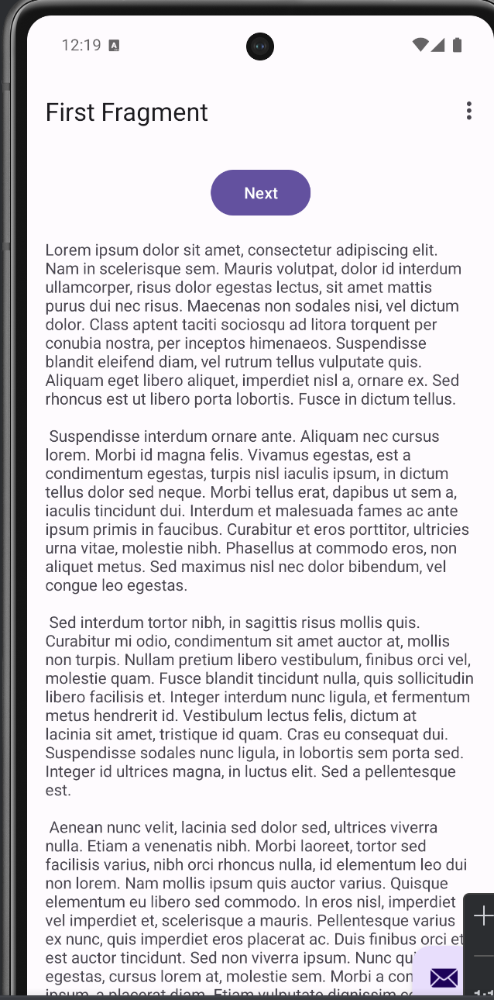
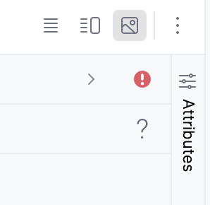

# 95-702 Distributed Systems for ISM
# Lab 8 Android Application Lab

Complete Lab8_Quiz on Canvas as you work on this lab. See the checkered flags for references to the quiz questions.

# Part 1: Hello Android
## You can do use AndroidStudio or IntelliJ, but AndroidStudio is **much** preferred!

**Warning:** The emulators for Android take up a *lot* of disk space. Be sure you have at least 10G available! Delete or move things to make room. You only need one emulator; if you (accidentally) install more than one and you end up short on disk space, delete the others.

### AndroidStudio Installation:
Install Android Studio from:

https://developer.android.com/studio

The current version is Android Studio Meerkat, 2024.3.1, but newer, unstable versions may be available.

### Intellij Note:
I strongly encourage you to use Android Studio.
If you want to try IntelliJ, make sure that your IntelliJ has the Android Support plugin installed; it should have been installed on the original download, but check anyway.  Choose Preferences (or File-> Settings) -> Plugins, and click on the Installed tab. You should see Android Support already installed; if not, IntelliJ will prompt you to install it.  

You'll also need the Android SDK installed. You can do this when you create the Hello Android project (but it might already be installed).  It does *not* replace the Java SDK - you need that, too (at least JDK 17).  

Some help is here:
https://www.jetbrains.com/help/idea/create-your-first-android-application.html

# Part 2 - Hello Android
# Create an Android Project in Android Studio

1. Choose "Create New Project" on the startup screen (later, if you have a project already open, do Choose File -> New -> Project like usual).
2. Choose the Phone and Tablet tab; click on the **Basic Views Activity** icon, then click Next.
3. Choose "HelloAndroid" as the project Name. This will change the Package name and Save location automatically.
4. Change the package name to something reasonable (e.g ds.edu.cmu.<yourAndrewID>)
5. (Optional) Change the Save location by clicking the small file folder icon to bring up the FileChooser. You may need to enter a new directory name.
6. Change the language to "Java" - it might default to "Kotlin" or nothing.
7. Select Minimum SDK API 35 ("VanillaIceCream") - higher is fine, too - Gradle, and click Finish. (Choosing a higher level will result in fewer phones to choose from, but we'll be using an emulator.) Click Finish.
8. The "Completing Requested Actions" window will show next; wait for it to load everything, then click Finish. The default project will show up; the Gradle build may take a moment.

You will see an Android project in the IDE; it will take a few moments to build.  It should be a fully-working "Hello Android" app.

**(Optional)** If you have multiple versions of the Java JDK installed - in particular, if you have 1.8 - it might default to an older version, which will not be compatible with the current version of the Android SDK. If you think that's an issue (you project doesn't build and the error message says you're using 1.8, say), then do this:

- on a Mac, click AndroidStudio->Settings->Build,Execution,Deployment->Build Tool ->Gradle

- click the down arrow at the end of the Gradle JDK field

- if jdk-21 shows up (17 is fine, too), click that; if not, click other, and (hopefully) all your JDK versions will show up: anything 16 or higher should be fine

- click Apply and OK

**(Optional)** If the Gradle Build errors out, check File->Project Structure -> Project. The Gradle Version should be 8.11.1. For me, even though these seemed to be set correctly, I had to reset them before it would work. Then the Gradle build executed again, and all was good.

## Test Hello Android in the AVD

1. On the Project tab on the left side of the screen, expand app->java-><your package name>, then click on the MainActivity.java tab to view the code.
2. If the default default showing in the box next to the green triangle is lower than a Pixel 6, you should upgrade to a Pixel 7 using the Device Manager/Device Explorer. You can open the Device Manager by expanding dropdown menu next to the green triangle button and choosing Device Manager (at the bottom of the menu) or look on the right margin and click on the Device Manager icon. Just beware that new phones may require downloading a different API, which can be time consuming.
3. Click the green triangle. The Gradle build will take a few moments.
4. If the phone does not automatically show up, click on the "Running Devices" icon on the far right side of the window to switch to the running AVD and verify that the Hello Android app has successfully launched. 

***Running Devices Icon***

5. Note that it may take a few moments for the emulator's phone to boot up. You might also have to click the power button on the phone. The emulator should start as a separate program (it may be behind other windows). It should say "First Fragment" with a Next Button, along with some placeholder text.

***Hello Android***

Clicking the Next button sends you to the Second Fragment, which has a Previous button that sends you back to the First Fragment - not very exciting. Using fragments is a little more complicated that just using a single screen, which is the way Part 2 works.

### :checkered_flag: Answer question 1 on the Canvas quiz named Lab8_Quiz.

IF YOU HAVE TROUBLE with the emulator - in particular, if you get the message "Waiting for process to come online" and then it times out - try the fixes on this web site, one at a time:

https://www.technipages.com/android-emulator-stuck-waiting-for-target-to-come-online

IF THE ANDROID EMULATOR BOOTS UP BUT THE APP DOES NOT LAUNCH - check if you're using "Quick Boot": go to the Tools -> Device Manager; click the down arrow on the right side of your chosen virtual device, and choose Edit.

Click Show Advanced Settings. Scroll down to Emulated Performance and
check "Cold Boot", not "Quick Boot". Click Finish. Then rebuild the app and run it again.

Look at the running app. Note the background color of the bar at the top of the first screen (mine is the background color). Note the text fields and the button. Click the button to get to the second screen. Android apps typically use multiple fragments (they're like a UI sub-window) contained in the main UI component; each fragments show a view of one part of the app.

## Exercises

On the right side, expand the Project view. You should see a more complicated directory structure than the usual IntelliJ listing, because there's more stuff to keep track of.

1. Explore the contents of the project's res directory. These are the static resource files that your Android app uses.  They include such things as menus, user interface (UI) definitions, icons, and strings.
2. Expand res>values to see the file strings.xml; this defines static strings that are used in your application: the app name, some labels, and the placeholder text. Change the string named "first_fragment_label", which currently should have the value "First Fragment", to your name (e.g. "Joe\'s App", with the escape character \ before the apostrophe). Then highlight all of the text in the "lorem_ipsum" tag and replace it with "My first Android app". It is recommended practice to place String constants in this file instead of defining them in your code.
3. Save strings.xml. Run the program again to see the changes.

### :checkered_flag: Answer question 2 on the Canvas quiz named Lab8_Quiz.

4. Examine res/layout/activity_main.xml. This is the UI definition of the main Activity.  There are three buttons at the top right of this window that toggle between Code, Split, and Design Mode (see the diagram below). You'll likely be in "Design Mode" initially; my design screen was tiny, so I clicked the + button to make it larger. The middle button changes to showing the design view together with the XML view; the left button switches to the XML view.
   

***XML View, Both, Design View Icons***

5. Edit res/layout/activity_main.xml.  This is the part of the screen layout for the overall app. Use the Design View to change the color of the toolbar (the upper rectangle in the design - click on it; its hard to tell that it is a component, but its outline should show up) to any new color: make sure the Attributes window is showing (if it's collapsed, there should be a sideways "Attributes" label on the right as shown above - click it). Scroll down until you can expand "All Attributes", then find "background" and the Edit pencil, which will bring up a color choose. Choose a color - the design view should change. Change to the XML view and notice the change to the XML file: the MaterialToolBar should now have a background setting using a numeric code for the color you chose. Rerun the app.

6. Edit fragment_first.xml. In the Design view, if the Palette window not visible, click the word Palette (printed sideways) in the left margin. In the Palette window, click on Text (right underneath Common). Click on "Plain Text" and drag a field onto your screen.

7. In the Attributes tab on the right, under the Properties of this widget, find the Declared Attributes, locate the "text" property, and reset the text value from "Name" to "Hello Android"

Save content_main.xml. Rerun the app.

# Part 2 Interesting Picture

1. Download the zipped AndroidInterestingPicture from Canvas and unzip it.

2. Open Android Studio. **If you already have a window open from Part 1, close it.**

3. Choose File->New->Import Project. From the file chooser, choose the folder containing AndroidInterestingPicture.

4. **(Optional)** Choose "Import project from external model", then Android Gradle and click Finish. The project should open; navigate to app->src->main->java, where you'll see the package directory. Note: I did not have to do this step; not sure if you will.

5. Get a Flickr API key from:
	http://www.flickr.com/services/api/misc.api_keys.html

   Note: you will be asked to create a Yahoo account. Don't forget what you use as a password. Yep, a Yahoo account.

6. Edit the file GetPicture.java and put your API key where it says "<< put your Flickr api key here >>" (replace the << and >> also!). Remember to save the file.

7. Click the green play triangle in the Android Studio menubar to run the app.
8. Choose the AVD you just created to run the app in.
9. Switch to the running AVD and verify that the InterestingPicture app has successfully launched.  Type in a keyword to search such as "boat" and click Submit and you should see a picture displayed.

Explore the project folders. The most important are the "java" and "res" folders.  The java folder has the source code for the application, and the res folder has the static resources as you saw in Part 1.

Within the java folder, you will see two classes:

ds.cmu.edu.interestingpicture.InterestingPicture
ds.cmu.edu.interestingpicture.GetPicture

Study the InterestingPicture class.  Android applications are organized into "activities" and this is the main activity for this application.  Read the comments and the code and understand how it works.

The GetPicture class is used to first search Flickr for a pictures related to a keyword, and then fetch a picture.  So that the phone user interface is not frozen while these network activities take place, these network actions must take place in a helper thread.  BackgroundTask makes it easy to use a helper thread.

### :checkered_flag: Answer question 3 on the Canvas quiz named Lab8_Quiz.

10. The application is missing the feedback "Here is a picture of a ..." or "Sorry, I could not find a picture of a..."
     a. Add a new TextView to res/layout/content_main.xml for this feedback
     b. In the pictureReady method, findViewById your new TextView
     c. Set the text of the TextView to the appropriate string (depending on whether the picture is found or not).
       (Where can you get the search term from to add to this string?)
11. Run and test it.

### :checkered_flag: Answer question 4 on the Canvas quiz named Lab8_Quiz.

### :checkered_flag: Answer question 5 on the Canvas quiz named Lab8_Quiz.

Don't leave the phone emulator or the app running - shut both down when you're done!